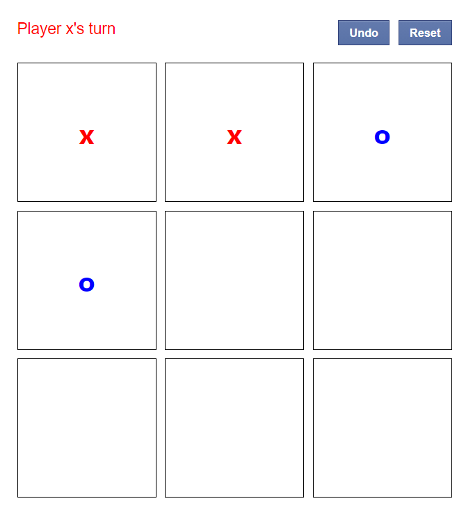

# Tic Tac Toe

This is a simple *Tic Tac Toe* game built using vanilla
Javascript. Demo can be found at www.hampii.com. Most of 
the code is organized into two modules: 
[game.js](modules/game.js) and 
[renderer.js](modules/renderer.js). Style code is found in 
[main.css](main.css). 

## Game.js

Implements the game logic. Game state is represented by 
objects of the type: 

```javascript
 {
  board: ['x', 'x', 'o', 'o', '', '', '', '', ''],
  currentPlayer: 'x',
  winner: false,
  done: false
};
```

The `board` string array represents the game cells. Empty cells
are represented by an empty string. `'x'` and `'o'` represents
plays by the player. The `currentPlayer`, `winner`, and `done` 
properties store more state about the game. 

In addition to the current state object, 
there is also an array, `previousState`, that stores 
previous game states. This enables the undo functionality.



The game module also exposes the methods `play`, `reset` and
`undo` that updates the current game state. 

### Play
Takes in a cell to update. The game checks to see if
the cell is playable (cell value is `''`) and if the 
if the game is not done. If these checks all pass
the method then:
*  clones the current state and stores it in a previous state
   array,
*  updates the cell with `'x'` or `'o'` based on the 
   current player,
*  checks whether there is winner or the game is tied,
*  and finally updates the current state to the new state

### Reset
This method just erases all the previous stored states
and sets the current state to the initial state (empty board).

### Undo
This method just pops a state from the previous state array
and sets that state to the current value.

## Renderer.js

Displays the current game state on the web page and listens
for user actions. Clicks on a cell will attempt to play
a turn. The renderer also listens for clicks on the
**reset** and **undo** buttons.


